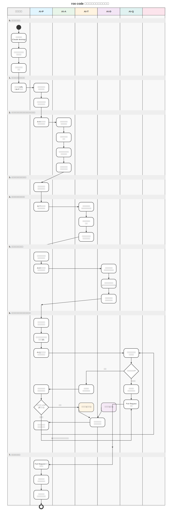

# 🚀 roocode-boomerang-mode 🚀

<!-- 必要であればヘッダー画像を追加 -->
<!--  -->

<!-- 他の技術スタックがあればバッジを追加 -->

roo code を利用して開発上の役割分担を厳密にしたモードを作成し、1 つのプロンプトに縛られずに役割ごとに作業を遂行するためのブーメランモード設定集です。

## 🎯 プロジェクトの趣旨

このプロジェクトは、AI による開発支援をより効率的かつ確実に行うために、開発プロセスを複数の専門的な役割に分割し、それぞれの役割に特化した AI モードを提供します。これにより、単一の AI プロンプトに依存するのではなく、各フェーズに最適化された AI モードを使用することで、より高品質な開発成果を得ることができます。

## 🛠️ 利用方法

### 1. モードの設定（2025/04/09 現在の roo code での設定方法）

1. roo code の Prompts メニューを開く
2. 「新しいモードを作成」ボタンを押す
3. モード名を設定（`mode/` ディレクトリ内の各マークダウンファイル名を使用）
   - AI-P: 進捗管理エージェント
   - AI-A: 分析・技術選定エージェント
   - AI-T: テスト実装エージェント
   - AI-D: 機能実装エージェント
   - AI-Q: 品質チェックエージェント
4. 「役割の定義」項目に、対応するマークダウンファイルの内容を貼り付ける

### 2. タスク開始前の準備

タスクを開始する前に、以下の準備が必要です：

1. `USER.md` を参照し、必要な事前準備を確認
2. 最低限必要な準備：
   - mcp github の設定
   - 対象リポジトリにタスク詳細を記載したイシューの作成

### 3. タスクの開始

1. roo code で AI-P モードを選択
2. イシュー URL と「タスク開始」の指示を入力
3. 実行を開始

## 🤖 提供されるモード

各モードは特定の役割と責任を持ち、開発プロセスの異なるフェーズを担当します：

- **AI-P**: 進捗管理エージェント（Progress Manager）

  - プロジェクト全体の進捗管理
  - 各フェーズ間の連携調整
  - イシュー管理とラベル更新

- **AI-A**: 分析・技術選定エージェント（Analyzer）

  - 要件分析
  - 技術スタック選定
  - プロジェクト構造設計

- **AI-T**: テスト実装エージェント（Test Implementer）

  - テストコードの実装
  - テスト戦略の策定
  - テストカバレッジの確保

- **AI-D**: 機能実装エージェント（Development Implementer）

  - 機能コードの実装
  - アーキテクチャ設計
  - コード品質の維持

- **AI-Q**: 品質チェックエージェント（Quality Checker）
  - コードレビュー
  - 品質基準の検証
  - 改善提案の作成

## 🌊 開発フロー

詳細な開発フローは [`FLOW.md`](FLOW.md) に記載されています。各モードの役割と連携方法、具体的な作業手順を確認できます。

<!-- wf.svg を表示する場合 -->

  

## ⚙️ 各モードの設定

各モードの詳細な設定とプロンプトは `mode/` ディレクトリ内の対応するファイルに記載されています：

- `mode/AI-P.md`: 進捗管理エージェントの設定
- `mode/AI-A.md`: 分析・技術選定エージェントの設定
- `mode/AI-T.md`: テスト実装エージェントの設定
- `mode/AI-D.md`: 機能実装エージェントの設定
- `mode/AI-Q.md`: 品質チェックエージェントの設定

## ⚠️ 注意事項

- 各モードは公式ドキュメントのみを参照し、一般のブログや非公式な情報源は使用しません
- 不明点がある場合は、必ずイシューを通じてユーザーに確認を求めます
- 各モードは特定の役割に特化しており、その役割以外の作業は行いません
